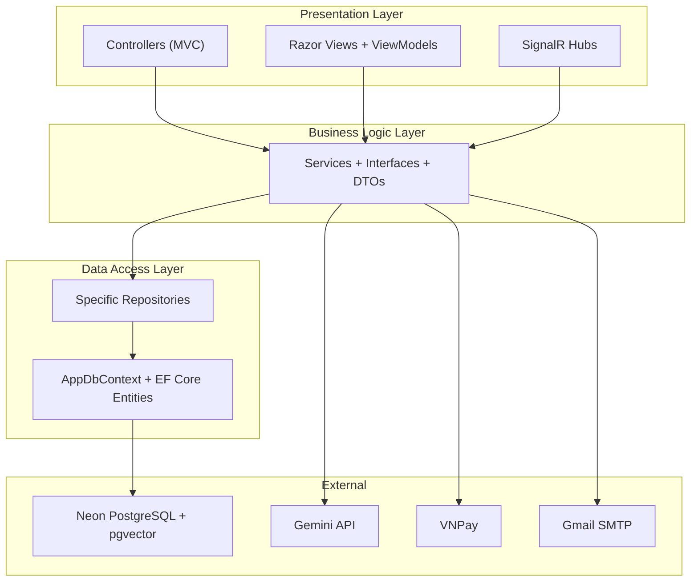
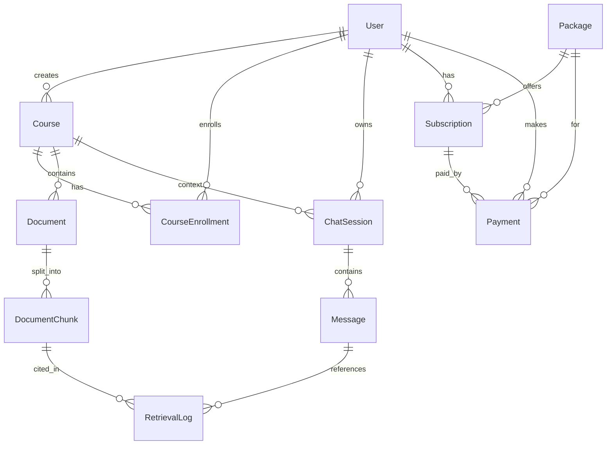
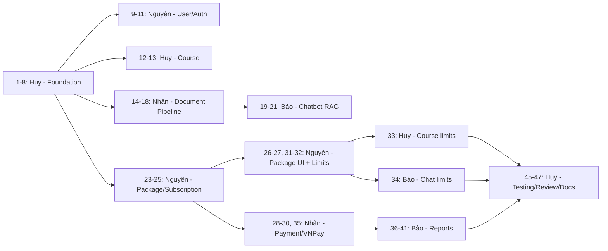

# Kế Hoạch Triển Khai — EduPlatform

## 1. Kiến Trúc Tổng Quan

Hệ thống bắt buộc sử dụng **3-Layer Architecture** và **ASP.NET Core MVC**. Không sử dụng Razor Pages ở bất kỳ module nào.

```
EduPlatform.sln
├── EduPlatform.Web/            ← Presentation Layer (MVC Controllers + Razor Views)
├── EduPlatform.BLL/            ← Business Logic Layer (Services, Interfaces, DTOs)
└── EduPlatform.DAL/            ← Data Access Layer (DbContext, Repositories, Entities)
```

Cấu trúc bên trong BLL:

```text
EduPlatform.BLL/
├── Interfaces/                 ← Service contracts
├── Services/                   ← Service implementations
├── DTOs/<Module>/              ← Commands và response DTOs theo module
├── Enums/
├── Exceptions/
├── Models/
├── Options/
└── DependencyInjection.cs
```



### Quy Tắc Phụ Thuộc

```text
EduPlatform.Web → EduPlatform.BLL → EduPlatform.DAL
```

- `Web` chỉ reference `BLL`, tuyệt đối không reference trực tiếp `DAL`.
- `BLL` reference `DAL`; `DAL` không reference ngược lên `BLL` hoặc `Web`.
- Controller chỉ gọi service của BLL, không gọi `AppDbContext` hoặc repository.
- BLL không trả EF Core Entity ra Web; dữ liệu qua ranh giới layer phải dùng DTO.
- ViewModel chỉ đặt trong `Web`; DTO và enum nghiệp vụ đặt trong `BLL`; Entity và cấu hình persistence đặt trong `DAL`.
- Đăng ký dependency bằng extension method của từng layer. `Program.cs` của Web chỉ gọi cấu hình BLL, không truy cập kiểu dữ liệu của DAL.
- Không sử dụng Unit of Work. `AppDbContext` chịu trách nhiệm transaction; chỉ tạo repository chuyên biệt khi có truy vấn dữ liệu rõ ràng.
- Tất cả giao diện người dùng dùng MVC Controller + Razor View. **Không sử dụng Razor Pages.**

### Công Nghệ Chốt

- .NET 10 (`net10.0`) và ASP.NET Core MVC.
- Entity Framework Core 10 + `Npgsql.EntityFrameworkCore.PostgreSQL` 10.x.
- PostgreSQL được host trên Neon; ứng dụng kết nối trực tiếp bằng Npgsql/EF Core.
- Neon `pgvector` phục vụ lưu và tìm kiếm embedding.
- Cookie Authentication + claims + role-based authorization; mật khẩu hash bằng BCrypt.
- Gmail SMTP qua MailKit.
- Thanh toán VNPay. Giá trị enum MoMo cũ chỉ được giữ để tương thích dữ liệu, không expose hoặc xử lý trong production flow.
- Bootstrap 5.

### Cấu Hình Môi Trường

`appsettings.json` chỉ chừa placeholder, không commit secret thật:

```json
{
  "ConnectionStrings": {
    "DefaultConnection": "",
    "MigrationConnection": ""
  },
  "Email": {
    "Host": "smtp.gmail.com",
    "Port": 587,
    "UseStartTls": true,
    "FromName": "EduPlatform",
    "FromAddress": "",
    "Username": "",
    "AppPassword": ""
  },
  "Gemini": {
    "ApiKey": ""
  },
  "VNPay": {
    "TmnCode": "",
    "HashSecret": "",
    "PaymentUrl": "",
    "ReturnUrl": "",
    "IpnUrl": ""
  }
}
```

Connection string Npgsql mẫu:

```text
Host=<NEON_HOST>;Port=5432;Database=<DATABASE>;Username=<USERNAME>;Password=<PASSWORD>;SSL Mode=Require;Channel Binding=Require
```

- `DefaultConnection`: pooled endpoint của Neon cho runtime.
- `MigrationConnection`: direct endpoint của Neon cho EF Core migration.
- Khi chạy thật, ưu tiên biến môi trường như `ConnectionStrings__DefaultConnection`, `Email__AppPassword`, `Gemini__ApiKey`, `VNPay__HashSecret`.
- Migration đầu tiên phải bật extension: `CREATE EXTENSION IF NOT EXISTS vector;`.
- Không tự động chạy migration khi production startup. Migration được chạy chủ động bằng CLI hoặc deployment pipeline.
- Gmail dùng Google App Password; tài khoản Google phải bật xác minh hai bước.

### ER Diagram



`Payment` phải lưu `PaymentMethod`, mã giao dịch nội bộ, mã giao dịch từ gateway và trạng thái xử lý để callback VNPay có thể chạy idempotent.

---

## 2. Phân Vai Trò

| Thành viên | Vai trò | Module chính |
|------------|---------|--------------|
| **Huy** | Leader | Foundation, Course, Email, Integration & Review |
| **Nhân** | Developer | Document, Payment/VNPay |
| **Bảo** | Developer | Chatbot RAG, SignalR, Report & Statistics |
| **Nguyên** | Developer | User, Authentication, Package, Subscription |

---

## 3. Danh Sách Task Chi Tiết

### Phase 1 — Foundation & Core

> Mục tiêu: Solution chạy được, Auth hoạt động, CRUD User & Course.

| # | Task | Người | Mô tả chi tiết | Dependency | Deliverable |
|---|------|-------|-----------------|------------|-------------|
| 1 | Tạo Solution + 3 Projects | **Huy** | Tạo solution gồm đúng 3 project `Web`, `BLL`, `DAL`, cùng target `net10.0`. Config reference `Web→BLL→DAL`; Web không reference DAL. Cài EF Core 10, Npgsql EF Core 10, pgvector, BCrypt và MailKit vào đúng layer. | — | Solution build thành công, dependency đúng 3 Layer |
| 2 | Thiết kế Entities | **Huy** | Tạo tất cả Entity classes: User, Course, CourseEnrollment, Document, DocumentChunk, ChatSession, Message, RetrievalLog, Package, Subscription, Payment. Dùng enum cho Role/Status. | Task 1 | Entities hoàn chỉnh |
| 3 | DTOs + Enums + ViewModels | **Huy** | Đặt DTO và enum nghiệp vụ trong BLL; đặt ViewModel trong Web; enum persistence đặt trong DAL. Không tạo Shared project và không truyền Entity từ BLL sang Web. | Task 1 | Contract giữa các layer rõ ràng |
| 4 | AppDbContext + Fluent API | **Huy** | Cấu hình EF Core 10, Npgsql, Neon PostgreSQL, indexes, constraints, seed tài khoản mẫu và pgvector. Tạo migration ban đầu có `CREATE EXTENSION IF NOT EXISTS vector`. | Task 2 | DbContext + Initial Migration |
| 5 | Data Access Repositories | **Huy** | Tạo repository chuyên biệt cho các truy vấn cần thiết. Không dùng Generic Repository cho mọi entity và không dùng Unit of Work; transaction dùng `AppDbContext`. | Task 4 | DAL đáp ứng truy vấn của BLL |
| 6 | Program.cs + DI | **Huy** | Đăng ký từng layer qua extension method, Cookie Authentication, authorization, SignalR và cấu hình Neon. Không auto-migrate khi production startup. | Task 5 | App khởi động và kết nối Neon được |
| 7 | Layout + Base Views | **Huy** | `_Layout.cshtml` (MVC), navbar, sidebar, CSS base (Bootstrap 5), _ViewImports, _ViewStart. | Task 6 | Layout template |
| 8 | Cookie Authentication + Authorization | **Huy** | Cấu hình Cookie Authentication, login/access-denied path, claims và role-based policies bằng cơ chế `[Authorize]` chuẩn của ASP.NET Core MVC. | Task 6 | Cookie auth và role policies hoạt động |
| 9 | UserService | **Nguyên** | `IUserService` + `UserService`: Authenticate (BCrypt), CRUD User, ChangePassword, ImportUsers (Excel/CSV), UpdateRole, GetByRole. | Task 5, 3 | UserService unit-testable |
| 10 | AccountController + Views | **Nguyên** | Login, Logout, Register, AccessDenied và Profile bằng MVC Controller + Razor Views và Cookie Authentication. Không dùng Razor Pages. | Task 7, 8, 9 | Auth flow end-to-end |
| 11 | AdminController — User CRUD | **Nguyên** | Admin: danh sách users, tạo user, đổi role, import users từ file. | Task 10 | Admin quản lý users |
| 12 | CourseService | **Huy** | `ICourseService` + `CourseService`: CRUD Course, Enrollment (có/không password), Invitation, Search (pagination), Toggle Visibility, Authorization checks theo role. | Task 5, 3 | CourseService unit-testable |
| 13 | CourseController + Views | **Huy** | Index (danh sách), Create, Edit, Delete, Search, Enroll, MyStudents, Invite. Phân biệt view theo role (Admin/Teacher/Student). | Task 7, 12 | Course CRUD end-to-end |

---

### Phase 2 — Document & Chatbot

> Mục tiêu: Upload tài liệu → RAG pipeline hoạt động, Chatbot trả lời được.

| # | Task | Người | Mô tả chi tiết | Dependency | Deliverable |
|---|------|-------|-----------------|------------|-------------|
| 14 | DocumentService | **Nhân** | Nhân chủ động thiết kế và triển khai nghiệp vụ quản lý tài liệu theo đúng ranh giới 3 Layer. | Task 5 | DocumentService |
| 15 | Text Extraction | **Nhân** | Nhân chủ động chọn cách trích xuất nội dung tài liệu phù hợp. | Task 14 | Text extraction hoạt động |
| 16 | Chunking Pipeline | **Nhân** | Nhân chủ động thiết kế cách chia và quản lý các đoạn nội dung. | Task 15 | Chunking pipeline |
| 17 | Embedding Pipeline | **Nhân** | Nhân tích hợp embedding và lưu vector vào Neon PostgreSQL/pgvector. | Task 16 | Embedding pipeline end-to-end |
| 18 | DocumentController + Views | **Nhân** | Hoàn thiện module tài liệu bằng MVC Controller + Razor Views; không dùng Razor Pages. | Task 17 | Document management UI |
| 19 | ChatService (RAG) | **Bảo** | `IChatService` + `ChatService`: Tạo session, gửi message → embed query → cosine search chunks (pgvector) → build prompt với context → gọi Gemini LLM → lưu Message + RetrievalLog. | Task 17, 5 | ChatService hoạt động |
| 20 | ChatController + Views | **Bảo** | Chat UI: sidebar list sessions, message area (bubble style), citation panel hiển thị source chunks. | Task 19 | Chat UI |
| 21 | SignalR ChatHub | **Bảo** | Hub cho realtime: SendMessage → stream response từ LLM → ReceiveMessage. Xử lý multiple concurrent sessions. | Task 20 | Real-time streaming chat |
| 22 | EmailService | **Huy** | `IEmailService` + `EmailService` dùng MailKit, Gmail SMTP port 587 + STARTTLS và Google App Password. Gửi email tạo account, invitation và payment confirmation; secret lấy từ environment. | Task 6 | Gmail gửi được |
| 23 | Package Seed Data | **Nguyên** | Tạo seed data 4 gói: Free (0đ, 2 courses, 10 chats/ngày), Plus (99k, 10 courses, 50 chats), Pro (199k, 20 courses, 100 chats), Max (399k, 200 courses, 200 chats). | Task 4 | Package data sẵn sàng |
| 24 | PackageService | **Nguyên** | `IPackageService` + `PackageService`: CRUD Package (Admin), GetActivePackages, GetById, Validate limits. | Task 23 | PackageService |
| 25 | SubscriptionService | **Nguyên** | `ISubscriptionService` + `SubscriptionService`: Create/Renew/Cancel Subscription, Check active subscription, Check limits (MaxCourses, DailyChats), GetByUser. | Task 24 | SubscriptionService |

---

### Phase 3 — Package Sales & Payment

> Mục tiêu: Student mua gói, thanh toán, subscription limits được enforce.

| # | Task | Người | Mô tả chi tiết | Dependency | Deliverable |
|---|------|-------|-----------------|------------|-------------|
| 26 | PackageController + Views | **Nguyên** | Pricing page: hiển thị 4 gói, so sánh tính năng, highlight gói hiện tại, nút "Mua ngay". | Task 24 | Pricing page |
| 27 | SubscriptionController + Views | **Nguyên** | Xem subscription hiện tại, lịch sử subscriptions, nút Renew/Cancel. | Task 25 | Subscription management UI |
| 28 | VNPay Integration | **Nhân** | Tích hợp sandbox VNPay: tạo payment request, ký request, xác minh chữ ký, xử lý ReturnUrl/IPN và cấu hình VNPay. | Task 25 | VNPay flow hoạt động |
| 29 | PaymentService | **Nhân** | `IPaymentService` tạo thanh toán VNPay, cập nhật trạng thái và kích hoạt subscription trong transaction. Callback phải idempotent, không kích hoạt subscription hai lần. | Task 28 | PaymentService an toàn với callback lặp |
| 30 | PaymentController | **Nhân** | MVC actions cho CreatePayment, VNPay Return, VNPay IPN, PaymentHistory và PaymentDetail. Không dùng Razor Pages. | Task 29 | VNPay payment flow end-to-end |
| 31 | Admin Package Management | **Nguyên** | Admin: CRUD Package (thêm/sửa/ẩn gói), xem danh sách tất cả subscriptions, xem payment history. | Task 26 | Admin quản lý gói & thanh toán |
| 32 | Subscription Limit Enforcement | **Nguyên** | Đưa kiểm tra quota vào BLL và cập nhật usage trong transaction để tránh race condition. Trả thông báo nâng cấp khi hết MaxCourses hoặc DailyChats. | Task 27 | Limit check hoạt động |
| 33 | Course limit integration | **Huy** | Khi tạo Course mới, gọi SubscriptionService check limit. Hiển thị thông báo "Bạn đã hết quota, hãy nâng cấp gói" nếu vượt. | Task 32 | Course creation respects limits |
| 34 | Chat limit integration | **Bảo** | Khi gửi tin nhắn, gọi SubscriptionService check daily chat limit. Hiển thị upgrade prompt nếu hết quota. | Task 32 | Chat respects limits |
| 35 | Payment Email Notification | **Nhân** | Gửi email xác nhận: thanh toán thành công, invoice, subscription activated/renewed. | Task 22, 29 | Payment emails |

---

### Phase 4 — Report, Statistics & Polish

> Mục tiêu: Dashboard, báo cáo, hoàn thiện UI, security review.

| # | Task | Người | Mô tả chi tiết | Dependency | Deliverable |
|---|------|-------|-----------------|------------|-------------|
| 36 | ReportService | **Bảo** | `IReportService` + `ReportService`: Aggregate queries — revenue by period, user growth, course stats, chat usage, top courses, subscription distribution. | Task 29, 5 | ReportService |
| 37 | Admin Dashboard | **Bảo** | Trang tổng quan Admin: tổng users, courses, revenue, active subscriptions. Charts dùng Chart.js hoặc ApexCharts. | Task 36 | Admin dashboard với charts |
| 38 | Revenue Report | **Bảo** | Doanh thu theo ngày/tuần/tháng, theo gói, theo payment method. Có export Excel (EPPlus/ClosedXML). | Task 36 | Revenue report page + export |
| 39 | User Analytics | **Bảo** | Số user mới theo thời gian, phân bố theo role, subscription distribution pie chart. | Task 36 | User analytics page |
| 40 | Teacher Statistics | **Bảo** | Teacher dashboard: số students enrolled per course, chat usage per course, document count, tổng quan hoạt động. | Task 36 | Teacher dashboard |
| 41 | Student Usage Report | **Bảo** | Student dashboard: chat history stats, subscription info, course progress, remaining quota. | Task 36 | Student dashboard |
| 42 | UI/UX Polish — User & Package | **Nguyên** | Responsive design, loading states, validation messages, toast notifications cho pages User/Package/Subscription. | Task 31 | Polished UI |
| 43 | UI/UX Polish — Course | **Huy** | Responsive design, error handling UX cho pages Course. | Task 33 | Polished Course UI |
| 43b | UI/UX Polish — Document & Payment | **Nhân** | Responsive design, file upload progress bar, chunk viewer cải thiện, payment flow UX. | Task 30 | Polished Document & Payment UI |
| 44 | UI/UX Polish — Chat | **Bảo** | Chat bubble styling, citation tooltip/modal, markdown rendering (Markdig), code syntax highlighting. | Task 34 | Polished chat UI |
| 45 | Integration Testing | **Huy** | Test end-to-end: Register → Login → Buy Package → Create Course → Upload Doc → Chat → View Report. Fix bugs. | Tất cả | Test report pass |
| 46 | Security Review | **Huy** | Kiểm tra: XSS, CSRF token, SQL injection, auth bypass, API keys không hardcode, input validation, anti-forgery. | Tất cả | Security checklist pass |
| 47 | Documentation | **Huy** | README (setup guide, environment variables, architecture overview). Hướng dẫn chạy local + deploy. | Tất cả | README hoàn chỉnh |

---

## 4. Tổng Hợp Theo Từng Người

### 👤 Huy — Leader (16 tasks)

| Phase | Tasks | Nội dung |
|-------|-------|----------|
| 1 | 1, 2, 3, 4, 5, 6, 7, 8, 12, 13 | Foundation + CourseService + CourseController |
| 2 | 22 | EmailService |
| 3 | 33 | Course limit integration |
| 4 | 43, 45, 46, 47 | UI/UX Polish Course, Integration Testing, Security Review, Documentation |

### 👤 Nguyên (11 tasks)

| Phase | Tasks | Nội dung |
|-------|-------|----------|
| 1 | 9, 10, 11 | UserService, AccountController (Auth), Admin User CRUD |
| 2 | 23, 24, 25 | Package seed data, PackageService, SubscriptionService |
| 3 | 26, 27, 31, 32 | PackageController, SubscriptionController, Admin Package, Limit Enforcement |
| 4 | 42 | UI/UX Polish — User & Package |

### 👤 Nhân (10 tasks)

| Phase | Tasks | Nội dung |
|-------|-------|----------|
| 2 | 14, 15, 16, 17, 18 | DocumentService, TextExtractor, Chunking, Embedding, DocumentController |
| 3 | 28, 29, 30, 35 | VNPay Integration, PaymentService, PaymentController, Payment emails |
| 4 | 43b | UI/UX Polish — Document & Payment |

### 👤 Bảo (11 tasks)

| Phase | Tasks | Nội dung |
|-------|-------|----------|
| 2 | 19, 20, 21 | ChatService (RAG), ChatController, SignalR Hub |
| 3 | 34 | Chat limit integration |
| 4 | 36, 37, 38, 39, 40, 41, 44 | ReportService, Admin Dashboard, Revenue, Analytics, Teacher/Student stats, Chat UI Polish |

---

## 5. Ma Trận File Ownership (Tránh Overlap)

| File/Folder | Huy | Nguyên | Nhân | Bảo |
|-------------|:---:|:------:|:----:|:---:|
| `DAL/Entities/` | ✅ | — | — | — |
| `DAL/AppDbContext.cs` | ✅ | — | — | — |
| `DAL/Repositories/` | ✅ | — | — | — |
| `BLL/DTOs/`, `BLL/Enums/` (base/common) | ✅ | — | — | — |
| `Web/Program.cs` | ✅ | — | — | — |
| `Web/Views/Shared/` (Layout) | ✅ | — | — | — |
| `BLL/**/User*`, `Web/**/Account*`, `Web/**/Admin*` (User) | — | ✅ | — | — |
| `BLL/**/Package*`, `BLL/**/Subscription*` | — | ✅ | — | — |
| `Web/**/Package*`, `Web/**/Subscription*` | — | ✅ | — | — |
| `BLL/**/Course*`, `Web/**/Course*` | ✅ | — | — | — |
| `BLL/**/Document*`, `BLL/**/TextExtractor*`, `BLL/**/Chunking*`, `BLL/**/Embedding*` | — | — | ✅ | — |
| `Web/**/Document*` | — | — | ✅ | — |
| `BLL/**/Chat*`, `Web/**/Chat*`, `Web/Hubs/` | — | — | — | ✅ |
| `BLL/**/Report*`, `Web/**/Report*` | — | — | — | ✅ |
| `BLL/**/Payment*`, `Web/**/Payment*` | — | — | ✅ | — |
| `BLL/**/Email*` | ✅ | — | — | — |
| `BLL/DTOs/`, `Web/ViewModels/` (theo module) | ✅ | ✅ | ✅ | ✅ |

> Mỗi thành viên chỉ tạo/sửa DTO và ViewModel thuộc module mình phụ trách. ViewModel nằm trong Web; DTO nằm trong BLL.
> Nếu cần sửa file không thuộc quyền → tạo PR tag Owner.

---

## 6. Thứ Tự Dependency (Ai Chờ Ai)



**Tóm lại:**
1. **Huy hoàn thành Foundation (1-8) trước** để chốt cấu trúc 3 Layer và contract chung
2. **Course, User, Document và Package** có thể chạy song song sau Foundation
3. **Nhân (Document)** chủ động xử lý toàn bộ module tài liệu
4. **Bảo (Chat)** sau khi Document pipeline xong (cần embedding)
5. **Nguyên (Package)** chạy song song với Document/Chat
6. **Nhân (Payment)** sau khi Package/Subscription xong
7. **Bảo (Report)** sau khi Payment xong (cần data revenue)
8. **Huy (Testing/Review)** cuối cùng

---

## 7. Checklist Nghiệm Thu

### Functional

| # | Hạng mục | Tiêu chí |
|---|----------|----------|
| F1 | Authentication | Cookie Authentication; đăng nhập/đăng ký/đăng xuất; password hash BCrypt |
| F2 | Authorization | Admin/Teacher/Student quyền đúng. Unauthorized → redirect |
| F3 | User CRUD | Admin tạo/sửa/xóa/import user |
| F4 | Course CRUD | Teacher tạo/sửa/xóa course. Admin quản lý tất cả |
| F5 | Enrollment | Student enroll (có/không password). Teacher invite. Accept/Reject |
| F6 | Course Search | Pagination + keyword search trên course visible |
| F7 | Document Upload | Upload PDF/DOCX/TXT. Validate type/size |
| F8 | RAG Pipeline | Upload → Extract → Chunk → Embed → Search hoạt động |
| F9 | Chatbot | Hỏi → Retrieve → Generate. Citation hiển thị |
| F10 | Real-time Chat | SignalR streaming. Multiple sessions |
| F11 | Package Display | Pricing page 4 gói, so sánh tính năng |
| F12 | Payment | Chọn VNPay → callback hợp lệ → Subscription activated đúng một lần |
| F13 | Subscription Limits | MaxCourses, DailyChats enforce đúng |
| F14 | Admin Dashboard | Tổng users, courses, revenue, charts |
| F15 | Reports | Revenue theo period, export Excel |
| F16 | Email | Gmail SMTP gửi khi tạo account, payment và invitation |

### Non-Functional

| # | Hạng mục | Tiêu chí |
|---|----------|----------|
| NF1 | Security | Không XSS, CSRF, SQL injection. API keys trong env |
| NF2 | Responsive | Desktop + Tablet + Mobile |
| NF3 | Error Handling | Custom error pages, friendly messages |
| NF4 | Code Quality | No build warnings. Consistent naming. No hardcode |
| NF5 | Architecture | Đúng 3 project/layer; dependency `Web→BLL→DAL`; Web không reference DAL |
| NF6 | Database | EF Core 10 + Neon PostgreSQL + pgvector; migration clean; seed và index đúng |
| NF7 | MVC | Mọi page dùng MVC Controller + Razor View; không có Razor Pages |
| NF8 | UI | Toàn bộ giao diện dùng Bootstrap 5 và responsive |

---

## Quyết Định Đã Chốt

- Kiến trúc: 3 Layer với đúng 3 project `Web`, `BLL`, `DAL`.
- Presentation: ASP.NET Core MVC; không dùng Razor Pages.
- Authentication: Cookie Authentication.
- Database: EF Core 10 + Neon PostgreSQL + pgvector.
- Payment: chỉ hỗ trợ VNPay trong production flow.
- Email: Gmail SMTP bằng Google App Password.
- UI: Bootstrap 5.
- Module tài liệu: Nhân chủ động thiết kế và triển khai.
